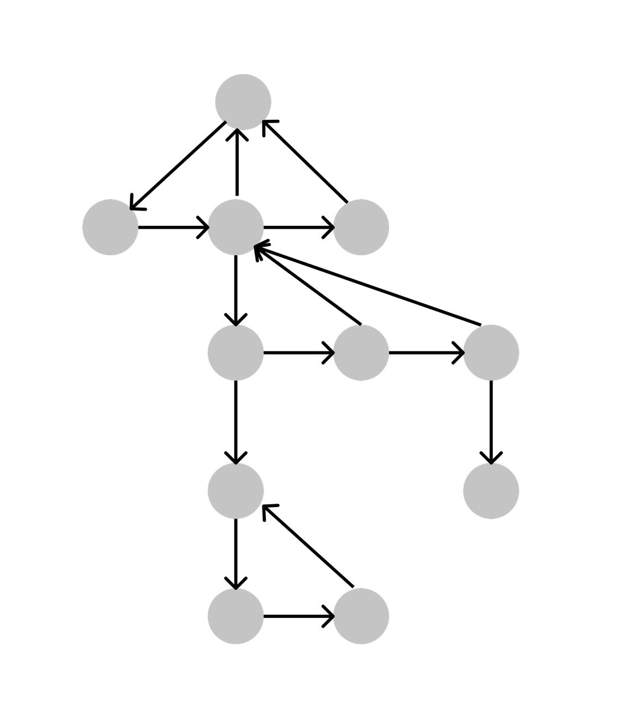

# cowfarm
Application represents cow farm. See some instructions and explanations below.

#How to run

    1. clone repository
    2. cd to root dir
    3. mvn clean install
    4. cd target/
    5. java -jar cowfarm-0.0.1-SNAPSHOT.jar $solutionType
    for $solutionType argument possible values 1 or 2
    example: java -jar cowfarm-0.0.1-SNAPSHOT.jar 2
    6. Follow instructions in console

#General notes

    1. Application does not contain any library except lombok and sl4j.  
    2. I tried to handle common exceptions but could miss something.
    3. Print farm data prints every cow which is still alive with whole hierarchy:
    Cow(id, name, parent = Cow(id, name, parent = Cow(id, name, parent = ... parent = Cow(id = 1, name = 'Burionka', parent = null))...)
    Cow with id 1 is always on the top of hierarchy
    4. For giveBirth method I decided to generate id for new cow instead of adding it manually.
    There simple counters for this purpose.
    5. 'Mother cow' which is on top of hierarchy alwasys alive.

#Solutions notes

    1. For solution 1 I decided not to use graph and used simple data structure Map<Cow, List<Cow>>.
    Every cow has id, name and parent. 
    Print farm and hierarchy looks like I described in general notes.
    add new cow - adding new entry to map with empty list + adding this new cow to parent`s list.
    remove cow - removing entry from map + removing from parent`s list. Removed cow stay parent for all it`s childs (It`s logical).

    2. Solution 2 is more complicated and it`s kind of graph.
    Every cow has id, name, parent, child, left, right.
    Print farm and hierarchy looks like I described in general notes and same with solution 1.
    add new cow - if parent cow have no child -> new cow = child of parent cow; if parent cow 
    already have child -> add to most right cow in chain
    remove cow - here is many cases available and for correct removing I used left.
    If removed cow had child - it will move to 1 level of hierarchy higher.
    Data structure for solution 2 looks like

 
